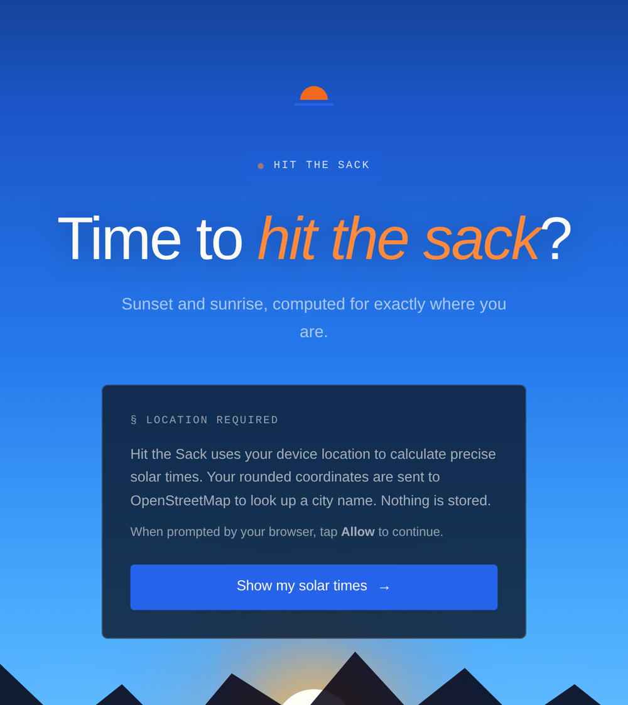
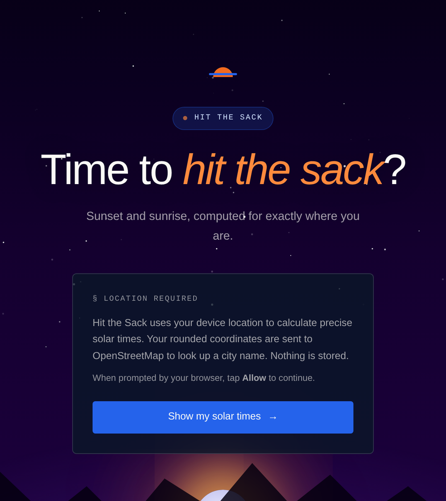
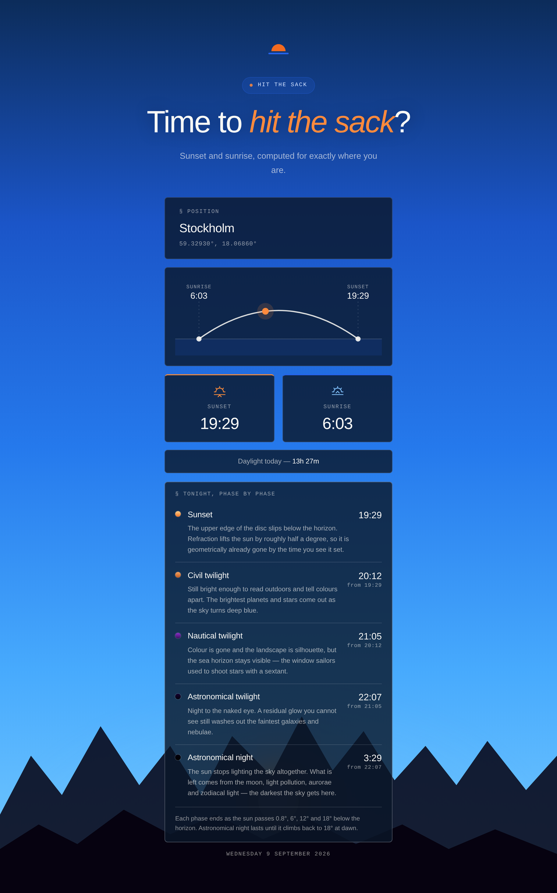

# 🌙 Hit the Sack

**Sunset, sunrise, and the whole slow collapse of the light in between — computed for exactly where you are standing.**

Every clock tells you what time it is. None of them tell you how much daylight
you have left, which in a Swedish winter is the only number that matters. On
21 December in Stockholm the sun sets at 14:49 — but there is usable light until
15:44, and knowing that is the difference between leaving the park early and
getting the last hour of it.

Built to answer that question honestly, and to prove out a reusable AWS
static-website stack while doing it.

**Live:** [hitthesack.archnops.com](https://hitthesack.archnops.com)

---

<table>
<tr>
<td width="50%"></td>
<td width="50%"></td>
</tr>
<tr>
<td align="center"><em>The sky follows the actual hour</em></td>
<td align="center"><em>…all the way down to stars and a moon</em></td>
</tr>
</table>

<p align="center"></p>

## What it does

- **Sunrise and sunset for your exact position**, drawn as an arc with the sun's
  current place on it, plus today's total daylight.
- **The night, phase by phase** — sunset, civil, nautical and astronomical
  twilight, then astronomical night, each with the time it ends and what the sky
  actually looks like while it lasts.
- **Handles the places where the question has no answer.** Above the Arctic
  Circle there is no sunrise to report; in a Stockholm June the sun never gets
  12° below the horizon, so nautical twilight simply never ends. The app says so
  rather than inventing a time.
- **A sky that tracks the real hour**, from midday blue through the sunset
  gradient to stars, interpolated between eleven keyframes and re-evaluated
  every minute.

No account, no settings, no history. You glance at it and leave.

## Architecture

```
  Browser ─────▶ CloudFront ──▶ S3 (private, Origin Access Control, sigv4)
     │              │            bucket policy scoped to this distribution's ARN
     │              │
     │              ├── AWS WAF (us-east-1, CLOUDFRONT scope)
     │              │     rate limit 2000 / 5 min / IP
     │              │     Common + KnownBadInputs + IpReputation
     │              │
     │              ├── Response headers policy
     │              │     CSP · HSTS · nosniff · frame-deny · COOP/CORP
     │              │     Permissions-Policy: geolocation=(self), rest off
     │              │
     │              └── Standard logging v2 ──▶ S3 logs bucket (SSE-KMS)
     │                                              │
     │                                              ▼
     │                                    Glue table (partition projection)
     │                                              │
     │                                              ▼
     │                                    Athena workgroup + saved queries
     │
     └── geolocation ─▶ (never leaves the browser)
         city name ───▶ nominatim.openstreetmap.org, coords rounded to 2 dp
```

**Services:** CloudFront · S3 · WAF · ACM · Route 53 · KMS · CloudWatch Logs ·
Glue · Athena · IAM · **IaC:** Terraform · **Frontend:** Astro 7, static output,
Tailwind v4.

Three accounts are in play: the workload account holds the site, a second owns
the `archnops.com` hosted zone, and a third holds Terraform state. The
certificate has to be issued in us-east-1 wherever the site lives, and validated
by DNS records written into another account's zone.

The reasoning behind each control — why OAC rather than a public bucket, why the
403 is translated at the edge rather than fixed in the bucket policy, why
partition projection instead of a crawler — lives with the module itself, since
that is what creates them.

## Why this shape

**The maths is fifteen lines, so it isn't a dependency.** The NOAA sunrise
equation, Julian cycle method, is accurate to within a minute below 72° latitude
and runs in the browser in a fraction of a millisecond. It returns UTC `Date`
objects, so the browser handles timezones and DST and this codebase contains no
timezone logic at all. Ask the same function for −6°, −12° and −18° and you get
the twilight phases from the identical code path; when it returns `null`, that
is the physics saying the sun never reaches that altitude today.

**Zero runtime dependencies, so the CSP is honest.** The shipped bundle is about
15 KB and all of it is mine — no `suncalc`, no geocoding SDK, no analytics. That
is what makes `script-src 'self'` with no `'unsafe-inline'` *true* rather than
aspirational. `connect-src` names exactly one external host. `base-uri`,
`form-action` and `object-src` are `'none'`, because nothing here needs them.
The one directive not yet earned is `style-src`, which still carries
`'unsafe-inline'` for the page's inline style attributes.

**One untrusted value, handled in one place.** The only data the app doesn't
compute itself is the place name from OpenStreetMap, which is community-editable
and therefore attacker-controlled in principle. It goes through a Unicode
allowlist and is written with `textContent`, never interpolated. Everything else
on the page comes from local constants or `Number.toFixed()`. There is a grep for
`textContent` in the built bundle to catch that being undone — see *Test*.

**Private bucket, and the 403 stays a 403 at the origin.** With Origin Access
Control and a policy granting only `s3:GetObject`, S3 cannot enumerate the
bucket for anyone — so a missing key returns 403, not 404. That gets translated
at CloudFront rather than fixed by granting `s3:ListBucket`, which would also
produce a real 404 and hand the internet a directory listing.

**Partition projection, not a crawler.** CloudFront standard logging v2 delivers
hive-partitioned Parquet directly, so the Glue table computes its partitions
from a path template. No crawler, no schedule, no crawler IAM role, and no
window where new logs are invisible because it hasn't run yet.

## Deploy

**Deployment is manual for now.** Workflows exist under
[`.github/workflows/`](.github/workflows/), but they are not enabled — see
*Not wired up yet* below before you turn them on.

```bash
# 1 · Infrastructure
terraform init -backend-config=backend.hcl
terraform apply

BUCKET=$(terraform output -raw web_bucket_id)
DIST=$(terraform output -raw cloudfront_id)
AWS="aws --profile Workload-Web"

# 2 · Build
(cd app && npm ci && npm run build)

# 3 · Upload. Order matters: hashed assets go up before the HTML that
#     references them, so no page can ever ask for a bundle that isn't there.
$AWS s3 sync app/dist/_astro/ "s3://$BUCKET/_astro/" \
      --cache-control 'public, max-age=31536000, immutable'

#     Then the HTML, which must always revalidate. --delete last, not first.
$AWS s3 sync app/dist/ "s3://$BUCKET/" --exclude '_astro/*' \
      --cache-control 'no-cache' --delete

# 4 · Invalidate, and wait for it — CloudFront is not done when the CLI returns
ID=$($AWS cloudfront create-invalidation --distribution-id "$DIST" \
        --paths '/*' --query 'Invalidation.Id' --output text)
$AWS cloudfront wait invalidation-completed --distribution-id "$DIST" --id "$ID"
```

The two `sync` calls are deliberately separate. `/_astro/*` filenames contain a
content hash, so they can never go stale and are served `immutable` for a year;
`index.html` is not hashed and must revalidate every time. A single `sync` would
give both the same header and throw away one or the other.

### Not wired up yet

The workflows are written but the repository is not set up to run them, and a
few pieces they depend on are currently absent:

- `providers.tf` uses named profiles only. The Terraform workflow passes
  `TF_VAR_assume_role_arn_route53`, which needs the `assume_role` blocks that are
  not in the file today.
- `terraform.yml` references `.tflint.hcl` and `.trivyignore`; neither exists.
- `variables.tf` still declares `assume_role_arn` and `assume_role_arn_route53`,
  which nothing reads — `tflint`'s unused-declarations rule fails on those.
- No OIDC roles, repository secrets or `production` environment are configured.

<details>
<summary><strong>What enabling them would take</strong></summary>

| Workflow | Trigger | Does |
|---|---|---|
| [`terraform.yml`](.github/workflows/terraform.yml) | `**.tf`, `**.hcl` | fmt · validate · tflint · trivy · gitleaks, then plan on PR and apply on merge |
| [`astro.yml`](.github/workflows/astro.yml) | `app/**` | `astro check` · build · `npm audit`, then sync to S3 and invalidate on merge |

Credentials would be short-lived, via GitHub OIDC — no AWS keys in the repository.

**Repository secrets**

| Name | Used by | Notes |
|---|---|---|
| `AWS_ROLE_ARN` | terraform | Role in the workload account. Needs read/write on `s3://<state bucket>/hitthesack/*`, granted by the state bucket policy. |
| `AWS_ROLE_ARN_ROUTE53` | terraform | Role in the DNS account. Its trust policy must allow `AWS_ROLE_ARN` as principal. |
| `TF_STATE_BUCKET` | terraform | The Terraform state bucket. |
| `TF_STATE_ROLE_ARN` | terraform | *Optional.* Only if the state bucket will not trust `AWS_ROLE_ARN` directly. |
| `AWS_DEPLOY_ROLE_ARN` | astro | May be the same ARN, but a role scoped to S3 write plus CloudFront invalidation is better. |

**Repository variables**

| Name | Used by | Value |
|---|---|---|
| `SITE_DOMAIN` | astro | `hitthesack.archnops.com` |
| `WEB_BUCKET`, `CLOUDFRONT_ID` | astro | *Optional.* Set to skip the CloudFront lookup. The bucket name carries a `random_id` suffix, so the lookup is the safer default. |

**Trust policies.** Scope every role to this repository and to the event that
should be able to use it:

```json
"StringLike": {
  "token.actions.githubusercontent.com:sub": "repo:jimmy-ao/web_hit-the-sack:ref:refs/heads/main"
}
```

The plan job additionally needs `…:pull_request`. The deploy role should carry
only the `main` condition — a pull request must never be able to write to the
bucket.

**Environments.** Both deploy jobs target a `production` environment. Adding a
required reviewer in Settings → Environments turns either pipeline into
approval-gated deployment without touching the YAML.

**Lock file.** The workflows run `terraform init -lockfile=readonly`, which fails
without `.terraform.lock.hcl` committed.

</details>

## Develop

```bash
cd app
npm install
npm run dev        # → http://localhost:4321
npm run build      # → dist/
npx astro check    # typecheck
```

Geolocation needs a secure context; `localhost` counts, so the dev server works.

Terraform runs against named AWS profiles supplied by `terraform.auto.tfvars`,
which is gitignored — one profile per account:

```bash
terraform init -backend-config=backend.hcl
terraform plan
```

## Test

There is no unit test suite. It is a static page with one pure function and no
state, and pretending otherwise would be worse than saying so.

What the unrun `astro.yml` does contain — and what is worth running by hand
before a deploy — are two guards on the properties actually worth guarding, both
checked against the *built* output rather than the source:

- **No inline `<script>` in `dist/index.html`.** The CSP is `script-src 'self'`
  with no `'unsafe-inline'`, so an inline script would be silently blocked in
  production. Better to fail the build than to find out from a blank page.
- **`textContent` still present in the bundle.** If the place name ever moves
  into a template literal, this fails.

Both are two lines of `grep` against `app/dist/`:

```bash
grep -o '<script[^>]*>' app/dist/index.html | grep -qv 'src=' && echo 'inline script — CSP will block it'
grep -q 'textContent' app/dist/_astro/*.js || echo 'place-name hardening is gone'
```

And after a deploy, worth checking that the headers actually arrived — configuring
a header and shipping one are different events:

```bash
curl -sI https://hitthesack.archnops.com/ | grep -iE 'content-security-policy|strict-transport|x-content-type'
curl -s -o /dev/null -w '%{http_code}\n' https://hitthesack.archnops.com/no-such-page   # expect 404
```

## Layout

```
.
├── app/                     Astro site
│   ├── src/pages/           index.astro (the whole app), error.astro
│   └── src/styles/          global.css — sky palette, cards, animations
├── docs/                    screenshots
├── .github/workflows/       terraform.yml, astro.yml — written, not enabled
├── main.tf                  module call — CSP, price class, logging, WAF flags
├── providers.tf             three accounts; profiles locally, OIDC in CI
└── backend.tf               S3 backend, partial config
```

The infrastructure itself lives in
[`terraform_aws_module-static-website`](https://github.com/jimmy-ao/terraform_aws_module-static-website).
This repository is the caller: it supplies `app`, `domain`, the CSP directives
and the feature flags, and nothing else.

## Cost

Small, but not zero, and the shape is worth knowing before you copy this.

The fixed monthly costs are the **WAF web ACL and its three managed rule
groups**, the **KMS key** encrypting the logs, and the **hosted zone**. WAF is by
far the largest of those — for a personal site with no real threat model,
`waf = { enabled = false }` removes it entirely. Everything else is usage-based
and at this traffic rounds to approximately nothing: `PriceClass_100` keeps
CloudFront on the cheaper edges, the bucket holds half a megabyte, and the
Athena queries are partition-pruned to 30 days behind a 10 GiB scan cutoff.

Check current pricing before assuming; these are the lines that move, not the
numbers.

## License

MIT — see [LICENSE](LICENSE).
